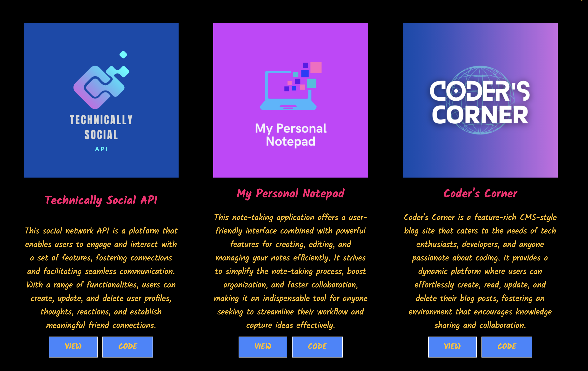
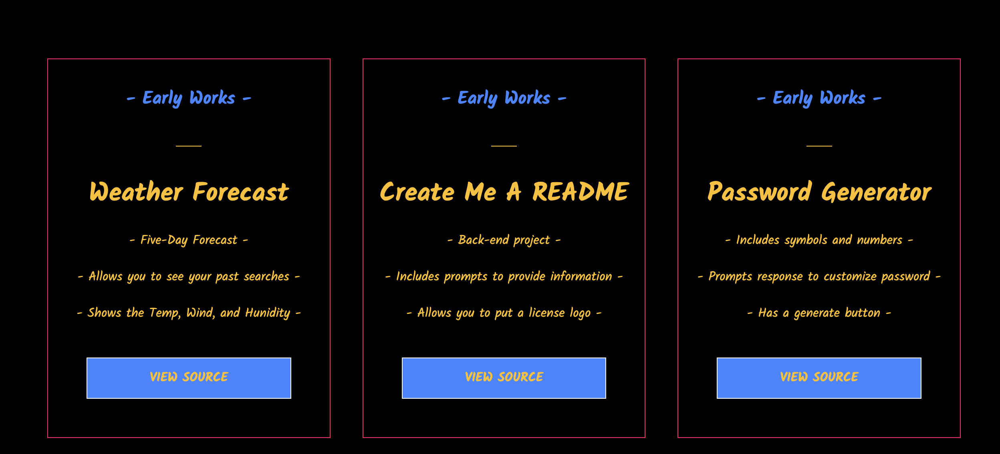
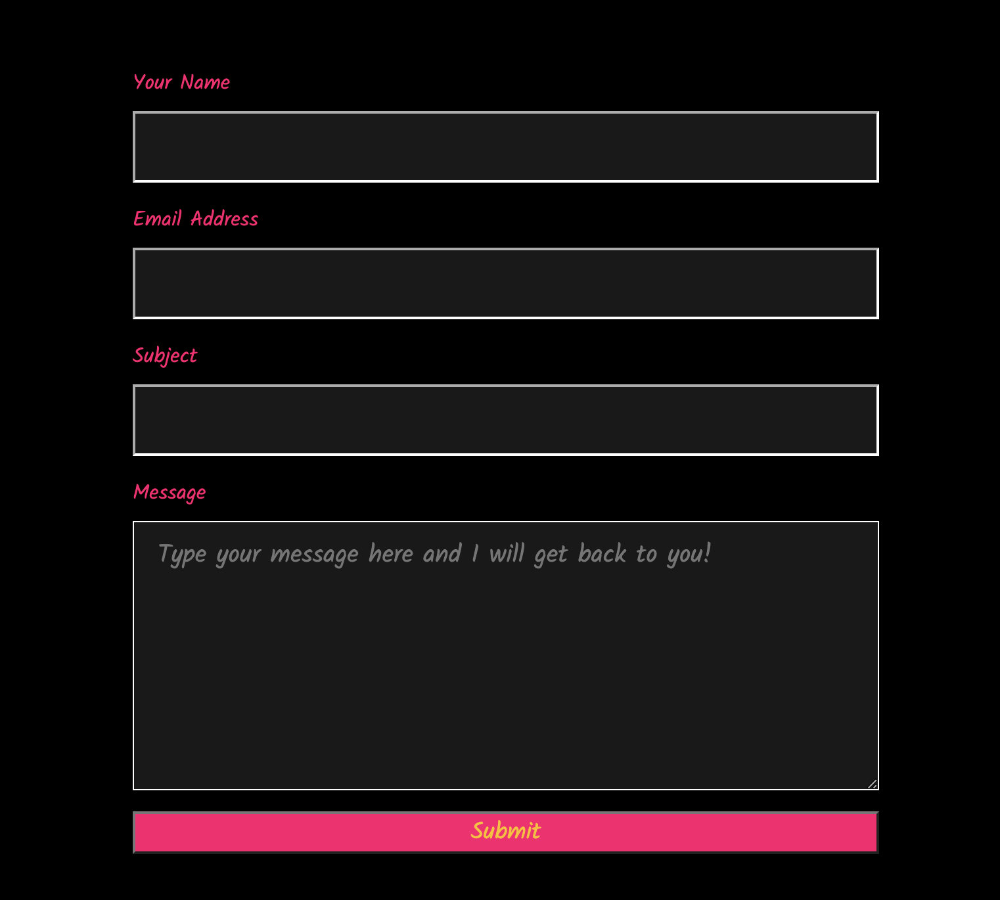
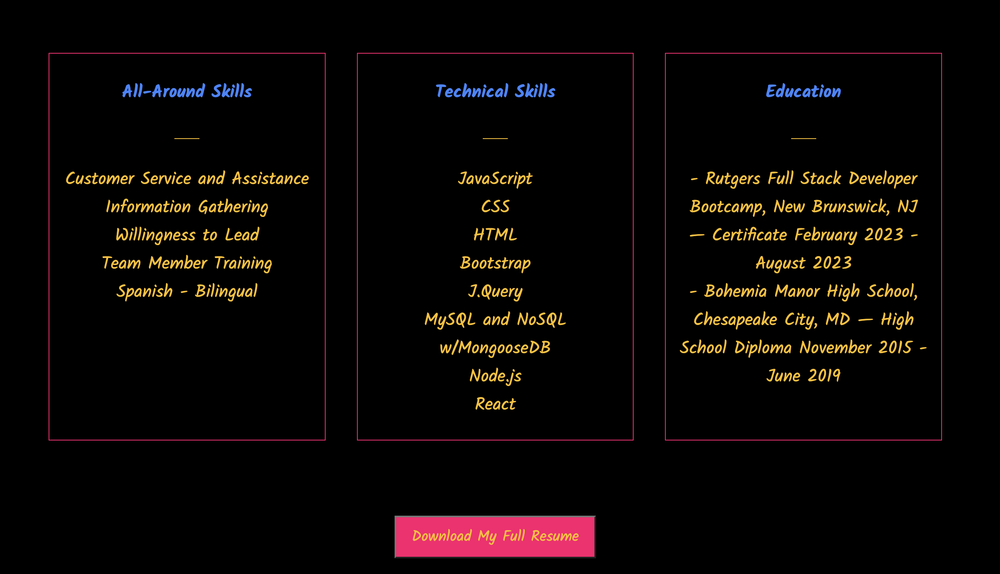

# portfolio-remastered

## Description

Upon loading the portfolio, you will be presented with a clean and user-friendly interface. The page consists of a header, a section for content, and a footer. The header contains the developer's name and a navigation menu with titles corresponding to different sections of the portfolio.

## Installation

To run this portfolio locally, follow these steps:

1. Clone the repository to your local machine.
2. Open the project directory in your preferred code editor.
3. Launch the index.html file in a web browser.
4. The portfolio will now be loaded in your browser.

## Building Blocks

The portfolio is built using modern web technologies, including HTML, CSS, and JavaScript. It utilizes responsive design principles to ensure compatibility with various devices and screen sizes. Additionally, it may incorporate frameworks or libraries such as React or Vue.js to enhance functionality and interactivity.

## Usage

Once the portfolio is loaded, you can navigate through different sections without the page reloading. The navigation titles include:

* About Me
* Projects
* Contact
* Resume

By default, when you first load the portfolio, the "About Me" section will be selected and displayed.

## Features

* About Me
In the "About Me" section, you will find a recent photo or avatar of the developer, along with a short bio that provides insights into their background, skills, and professional journey.

* Projects
The "Projects" section showcases the developer's applications. It displays titled images of six applications, each accompanied by links to both the deployed application and its corresponding GitHub repository. You can explore the developer's projects by clicking on these links.

* Contact
The "Contact" section provides a contact form where you can reach out to the developer. The form includes fields for your name, email address, and message. When you move the cursor out of a field without entering any text, you will receive a notification indicating that the field is required. If you enter an invalid email address, a notification will inform you of the error.

* Resume
In the "Resume" section, you will find a link to download the developer's resume. Additionally, a list of the developer's proficiencies, including programming languages, frameworks, tools, and technologies, will be provided. This section gives you an overview of the developer's skills and areas of expertise.

* Footer
The footer of the portfolio contains text or icon links to the developer's profiles on various platforms. You will find links to their GitHub, LinkedIn, and Facebook. These links allow you to connect with the developer on different platforms and learn more about their work.

## License

## Contact

If you have any questions about this application, please contact me at jadyngg19@gmail.com. You can find more of my work at https://github.com/Jadyngg19.